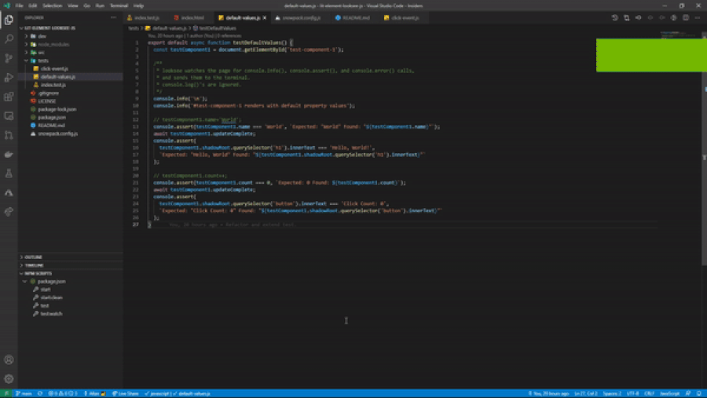
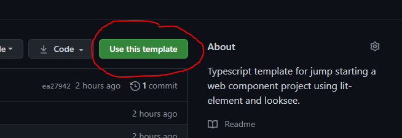

#   

A simple and straightforward way of testing web components:

```javascript
export default async function testDefaultValues() {
  console.info('\n');
  console.info('#test-component-1 renders with default property values');
  
  const testComponent1 = document.getElementById('test-component-1');

  console.assert(testComponent1.name === 'World', `Expected: "World" Found: "${testComponent1.name}"`);
  console.assert(
    testComponent1.shadowRoot.querySelector('h1').innerText === 'Hello, World!', 
    `Expected: "Hello, World" Found: "${testComponent1.shadowRoot.querySelector('h1').innerText}"`
  );

  console.assert(testComponent1.count === 0, `Expected: 0 Found: ${testComponent1.count}`);
  console.assert(
    testComponent1.shadowRoot.querySelector('button').innerText === 'Click Count: 0', 
    `Expected: "Click Count: 0" Found: "${testComponent1.shadowRoot.querySelector('button').innerText}"`
  );
}
```

**Did you catch that smooth testing framework API? 👀 It looks like straight browser DOM access! No strange syntax or foreign API calls for accessing the DOM. Just use the browser DOM API you know and love. That's right, baby. Sweet, sweet unmolested ***javascript***. 😂🤣**

**IMAGINE.** Front-end developer opens up a code editor. Starts typing out a test in unmolested vanilla javascript, attaches the test to the html page in question via a script tag, loads the html in a dev server, and receives the test results in the terminal.

**SIMPLE.** You write your test in the language and framework you know and love best: ***html, css, and javascript***.

**STRAIGHTFORWARD.** No fancy configurations, complicated abstractions, or learning curves. Just attach your test to the html page, run `looksee`, and that's it.

If you are a front-end developer, then you know how frustrating integrating testing into your project can be:

* First, what testing framework and/or tools do you ***choose***? Jest, mocha, karma, jasmine, selenium, etc.?

* Then, once you settle upon a few, you have to figure how to make them play nice with each other ***and*** with the framework and/or tools you are using to ***build*** your project.

* Last but not least, you have to ***learn*** the testing framework API and any special syntax required by the framework.

I don't know about you, but I ***hardly*** have enough time to keep up with the ever-changing build tools and frameworks that my projects rely on, let alone the testing landscape.

***All I want to do is write html, css, and javascript!***

That's where **looksee** comes into the fray. It gets out of your way, and allows you to write your tests using what you already know. You sprinkle `console.info`, `console.assert`, `console.error` calls in your test code, and **looksee** will report it out to the terminal. 



In an automated workflow, such as GitHub Actions, **looksee** will halt the press if a `console.assert` test fails or `console.error` occurs.

## Getting Started

### Set up in an existing project

Install package as a development dependency:
```shell
> npm i -D looksee
```

Add the following commands to your package.json `scripts` object, where `<urls>` is a space-separated list of urls to the html pages that have testing scripts embedded:
```json
"scripts": {
  "test": "looksee -u <urls>",
  "test:watch": "looksee -w -u <url>",
  "test:ci": "looksee -a -u <url>",
}
```

Start up your dev server and then in the terminal type:
```shell
> npm run test
```

If you have a dev server that has fast, hot reloading (a.k.a [snowpack dev](https://www.snowpack.dev)), then try out:
```shell
> npm run test:watch
```

The final command above `test:ci` should only be used in an automated workflow, such as GitHub Actions.

### Try a starter template instead

You can clone one of our starter projects, and have a looksee first, before wiring it up in your existing project:

* [Javascript Starter Template](https://github.com/look-see/lit-element-looksee-js)
* [Typescript Starter Template](https://github.com/look-see/lit-element-looksee-ts)

***If you have a GitHub account, you can simply click the big green template button on the starter template home page to quickly clone it into your account.***



###### Copyright (c) 2021 Allan Mobley Jr. All rights reserved.
###### Licensed under the [MIT](./LICENSE) license.
